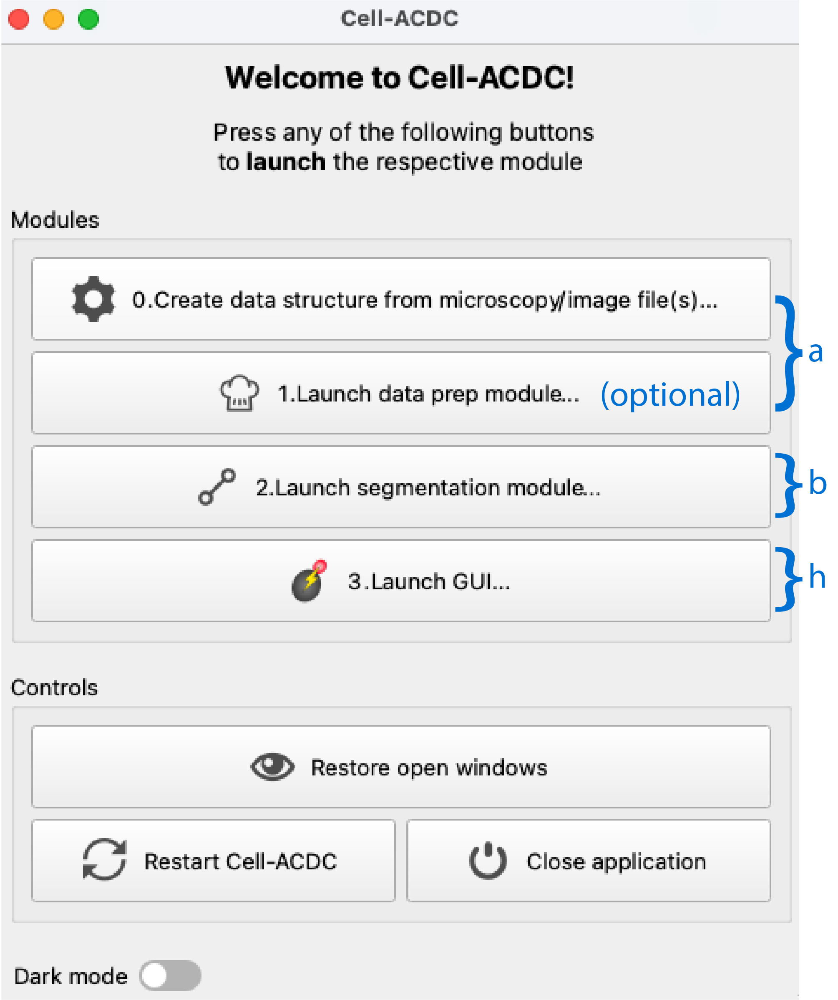
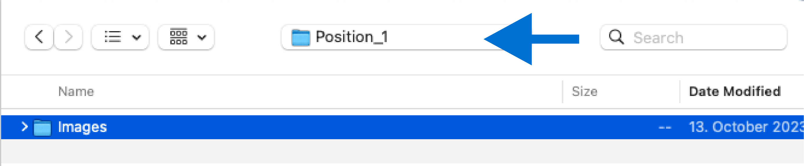
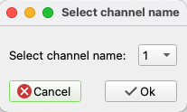
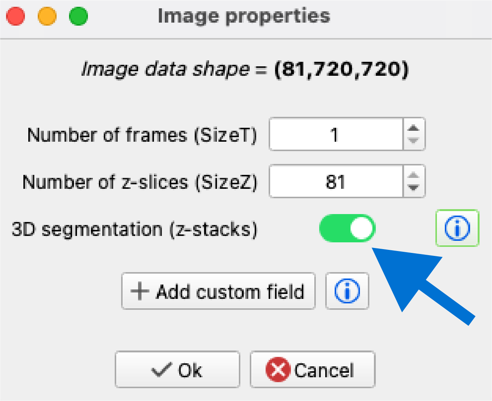
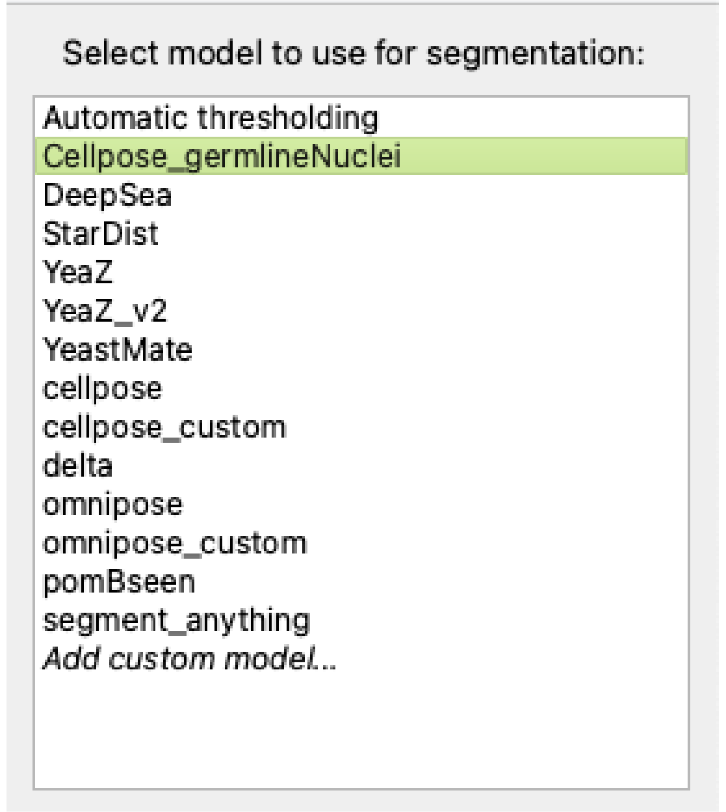
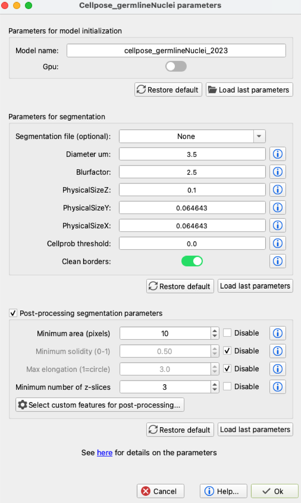

# Cellpose_Celegans_germlineNuclei #
 Cellpose model for segmentation of nuclei in the distal *C. elegans* germline

# 1. Installation #
===================

The `Cellpose_germlineNuclei` data processing and cellpose model are
    integrated into the Cell-ACDC framework available at
    [github](https://github.com/SchmollerLab/Cell_ACDC) (Padovani et al, 
    BMC Biol. 2022;
    20(1):174. [doi: 10.1186/s12915-022-01372-6](https://bmcbiol.biomedcentral.com/articles/10.1186/s12915-022-01372-6)). 

The `Cellpose_germlineNuclei` model is installed automatically by
    selecting the model in Cell-ACDC (see below). The model can also be
    installed manually by `Add custom model... > I have the
    model, let me select it` and choosing the `acdcSegment.py` file of
    the `Cellpose_germlineNuclei` model.

Alternatively, the python script may be integrated into other custom
    image analysis pipelines.

# 2. Segmentation using the Cellpose_germlineNuclei model in Cell-ACDC. #
=========================================================================

(a) Prepare microscopy data as described in the Cell-ACDC [user
    manual](https://github.com/SchmollerLab/Cell_ACDC/blob/main/UserManual/Cell-ACDC_User_Manual.pdf). (Step 0 in
    the Cell-ACDC interface).

Optional: We recommend using the `Launch data prep module...` (Step 1) to select a small region of interest for optimizing parameters on larger data sets. 

	
(b) Launch the segmentation module (Step 2 in the Cell-ACDC
    interface).
	
(c) Select the `Position folder(s)` containing data prepared in
    step a (see CellACDC user manual for information on data structure
    requirements).

	
(d) Select the channel for segmentation (DAPI/chromatin or
    synaptonemal complex staining).

(e) Verify the size of the z-stack and select "3D segmentation".

(f) Select the `Cellpose_germlineNuclei`  model.

(g) Adjust parameters as necessary. For information on specific parameters, click on 

(h) Run segmentation and process as outlined in the Cell-ACDC user manual using the Cell-ACDC GUI.

# 3. Training #
=========================================================================

To improve the segmentation of germline nuclei for specific data sets, the `Cellpose_germlineNuclei` model may have to be retrained. Our training data and a jupyter notebook containing the code for re-training is listed in the `training` folder. 

